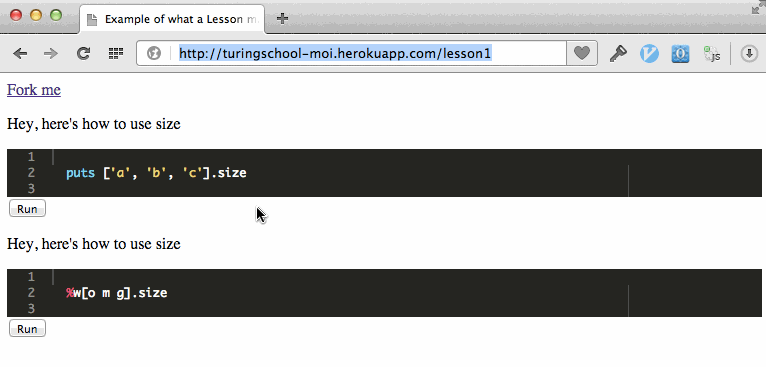

Overview
--------

Currently hosted [here](http://104.131.24.233/).

I want to increase student engagement by embedding a runnable
Ruby editor in the middle of their lessons. Then I can place
interactive examples inline with the explanations. This idea
is inspired by the [ExplorableExplanations](http://worrydream.com/ExplorableExplanations/)
blog (even though Bret Victor would likely find this project inadequate).

Getting started
---------------

<table>
  <tr>
    <td> Install dependencies with </td>
    <td> <code>rake bootstrap</code> </td>
  </tr>
  <tr>
    <td> Run tests with </td>
    <td> <code>rake</code> </td>
  </tr>
  <tr>
    <td> Run server with </td>
    <td> <code>rake server</code></td>
  </tr>
  <tr>
    <td>Add your first endpoint with </td>
    <td>`curl localhost:9292/endpoints -d 'endpoint[repopath]=https://gist.github.com/3e9b75fc0bdf22c6a7a2.git' -d 'endpoint[ref]=master' -d 'endpoint[main_filename]=gistfile1.txt' -d 'endpoint[owner]=dalexj' -d 'endpoint[webpath]=example' -d 'endpoint[desc]=Example of an endpoint.'`</td>
  </tr>
</table>

Contributing
------------

* **Finding something to do**
  * Pick an unassigned [issue](https://github.com/JoshCheek/miniature-octo-ironman/issues)
  * See a problem? Fix it.
  * Have an idea? Open an issue.
* **Pull often.** Especially before starting any stories. Expect master to update frequently, you want to be on the cutting edge,
  hovering around the project's master branch, so that all changes are small and easy to bring in,
  with low likelihood of merge conflicts, and low likelihood of diverging from what others are doing,
  and as much of everyone else's work as possible, so that there is very little holding you up.
* **Try to work in small steps** so that you can get your code merged into master as *often* as possible! Ideally, you could merge every 20 minutes or so.
* **Disdain perfection** Small improvements are all we need, trying to be perfect will prevent your code from getting into the codebase,
  which will conflict with working in small steps. Remember, we can always change it, we can always fix it.
  A commit that does half a story can be merged if it doesn't break things.
* **Always make sure tests are passing before pushing / sending a pull request.**
* **Make sure any relevant behavior is tested**, so we don't break your shit when we change it (we'll do the same for you, so you can change our shit without fear)
  If you're having difficulty knowing what or how to do this, come ask.
* **In any relevant commits, mention the issue number** (e.g. [#17](https://github.com/JoshCheek/miniature-octo-ironman/issues/17)),
  they will automatically be associated with the issue ([more on linking](https://help.github.com/articles/writing-on-github#references))
* **Merge your code**
  * If you're a collaborator, just push to master.
  * If you're not a collaborator, send a pull request (if you send enough PRs, I'll add you as a collaborator).
* **Mark your story as done** when your commits complete it. Or ask for review if you aren't sure.
* **Do not get emotionally attached to your code** it isn't you, it isn't a reflection on you,
  criticisms of it aren't criticisms of you, it's not special, it's not sacred. Neither is anyone else's.
  Expect your code to get modified / deleted, don't fear modifying / deleting any existing code,
  it's much more important that the codebase as a whole improves. Once code is merged, it's no longer your code,
  it now belongs to everyone who works on the project. This means you should be appreciative of changes,
  they represent improvements to the codebase, which makes the project better for all of us.

Vision
------

For now, just match what [Rubymonk](https://rubymonk.com/) can do (run some code, show the output).
In the future, if I have time/energy/competence, maybe get the environment
to become considerably better. Here are things that entice me:

* Syntax awareness in the editor (e.g. mouse over the var, it says its a local var, shows where its defined, might be able to use [rsense](https://rsense.github.io/) for this)
* More interesting dynamic environments, e.g. [SiB](https://github.com/JoshCheek/seeing_is_believing), and test suites to check user submissions to challenges.
* Ability to render an image of the object model and see how it updates as the user steps through the code (basically, dynamic explorable version of my [ObjectModel talk](https://github.com/JoshCheek/ruby-object-model)).
* Support more sophisticated environments (e.g. gems) this will be difficult, though, without more control over the [executing environment](https://eval.in/) (maybe I can get added to that project)
* Support other languages (this is inherently doable, eval.in already supports many)
* Read through [this](http://worrydream.com/LearnableProgramming/) and get some ideas.

Future shit maybe
-----------------

* manifest of lesson names to git repositories (ie gist) rather than having to edit the source of the server to change a lesson
* maybe scoped by content owner
* maybe overridable language for the editor
